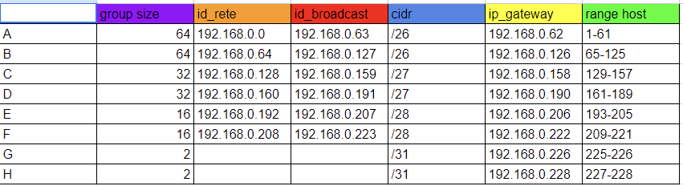

# VLSM

#Obbiettivo

Realizzare una rete come nello schema sotto riportato, utilizzando le regole VLSM(variable length subnet mask).

#Soluzione

Per iniziare abbiamo creato la tabella della rete.

